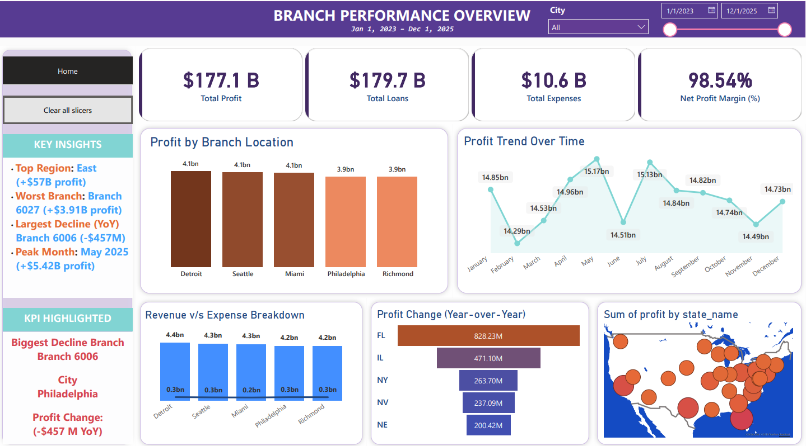

# Branch Performance & Profitability Dashboard

## Overview

This project analyzes **branch-level financial performance** using a banking dataset to identify:

* Underperforming branches
* Profitability trends over time
* Key drivers of performance (revenue vs expenses)
* Geographic patterns across regions

The goal is to simulate a real-world data analyst workflow by transforming raw financial data into **actionable business insights** using SQL and Power BI.

---

## Business Problem

Financial institutions like credit unions need to continuously monitor branch performance to:

* Identify declining or underperforming branches
* Understand whether issues are driven by **low demand or high costs**
* Support decisions such as **branch optimization and expansion**

This project answers:

> **Which branches are performing well, which are declining, and what factors are driving performance differences?**

---

## Dataset Description

The dataset consists of multiple **fact and dimension tables**:

### Fact Tables
* Loans
* Deposits
* Fees
* Operating Expenses

### Dimension Tables
* Branch (location, region)
* Date (daily level)

---

## Data Modeling Approach

### Key Challenge
The dataset had **inconsistent granularity**:
* Fact tables: monthly
* Date dimension: daily

### Solution
Standardized all data to: **One row per branch per month.**

### Steps
1. Created a **monthly date dimension**.
2. Aggregated all fact tables to the monthly level.
3. Built a final analytical view: `branch_profitability`.

This view includes:
* loan_amount
* deposit_amount
* fee_income
* total_expenses
* calculated_profit

---

## Tech Stack

* **SQL (PostgreSQL)**: Data transformation & modeling
* **Power BI**: Dashboarding & visualization
* **DAX**: Dynamic metrics and calculations

---

## Data Pipeline

**Raw Tables** -> **SQL Transformations** -> **branch_profitability View** -> **Power BI Dashboard**

---

## Key Metrics

* **Total Profit**
* **Loan Volume**
* **Deposit Amount**
* **Fee Income**
* **Operating Expenses**
* **Profit Change (Year-over-Year)**

---

## Dashboard Features

1. **KPI Overview**: High-level summary of Profit, Loans, Deposits, and Expenses.
2. **Branch Comparison**: Profit by branch to identify top and bottom performers.
3. **Trend Analysis**: Monthly profit trends to detect declining branches.
4. **Year-over-Year Analysis**: Profit change by branch highlighting improvement or decline.
5. **Revenue vs Expenses**: Analysis to determine if issues are demand-related or operational.
6. **Geographic Analysis**: Map showing branch performance by state to detect regional patterns.

---

## Key Insights

* **Branch Decline**: Some branches show consistent decline in profitability, requiring further investigation.
* **Categorized Issues**: Performance issues are typically categorized into Revenue decline (low activity) or Expense increase (inefficiencies).
* **Regional Demand**: Certain regions demonstrate stronger performance trends, suggesting geographic influence on demand.

---

## Business Impact

This analysis enables:
* Identification of underperforming branches.
* Data-driven decisions for cost optimization or growth strategies.
* Evaluation of branch expansion opportunities.
* Improved understanding of financial and operational drivers.

---

## SQL Highlights

Key techniques used:
* **CROSS JOIN**: To create branch-month combinations.
* **LEFT JOIN**: To retain full data coverage.
* **COALESCE**: To handle missing values.
* **date_trunc**: To standardize time granularity.
* **Aggregations**: SUM, GROUP BY.

---

## Repository Structure

```text
├── README.md
├── project_report.md
├── sql/
│   ├── 01_create_dim_month.sql
│   ├── 02_monthly_fact_views.sql
│   ├── 03_branch_profitability_view.sql
│   ├── 04_validation_queries.sql
│   └── 05_analysis_queries.sql
├── powerbi/
│   └── dashboard_screenshots/
└── docs/
```